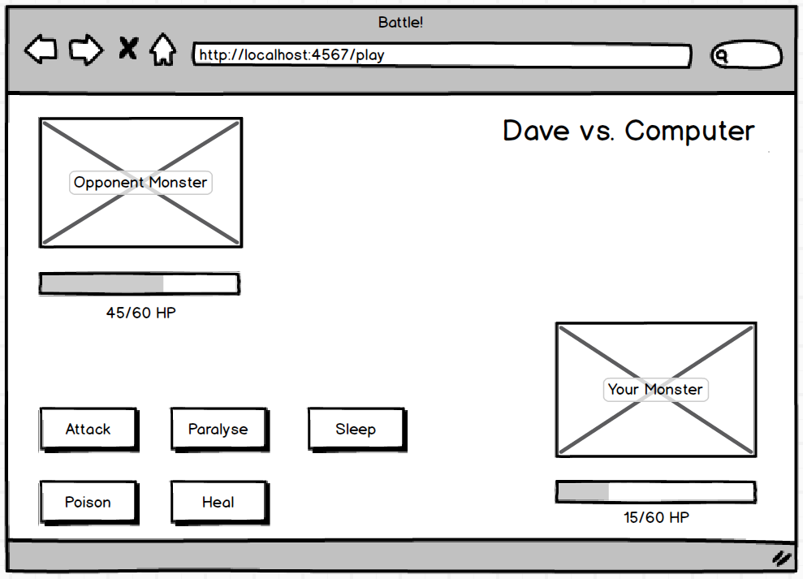

# Battle 
 - Building a short form RPG game that makes use of Ruby's Sinatra framework along with Capybara for testing driven development to build a game that has two players battling against each other.

